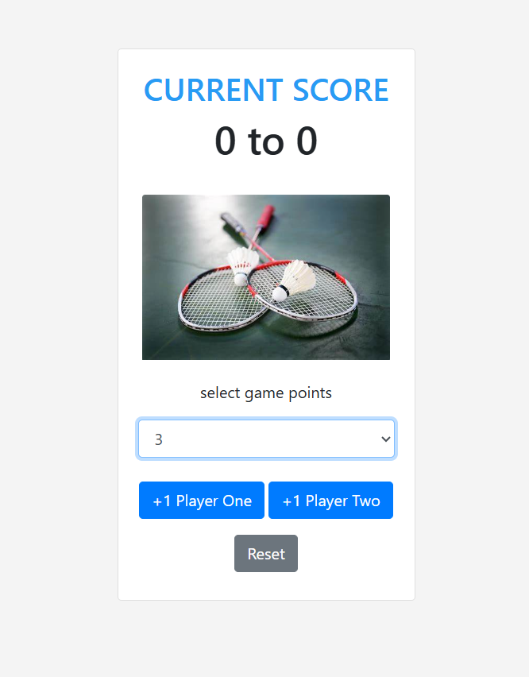
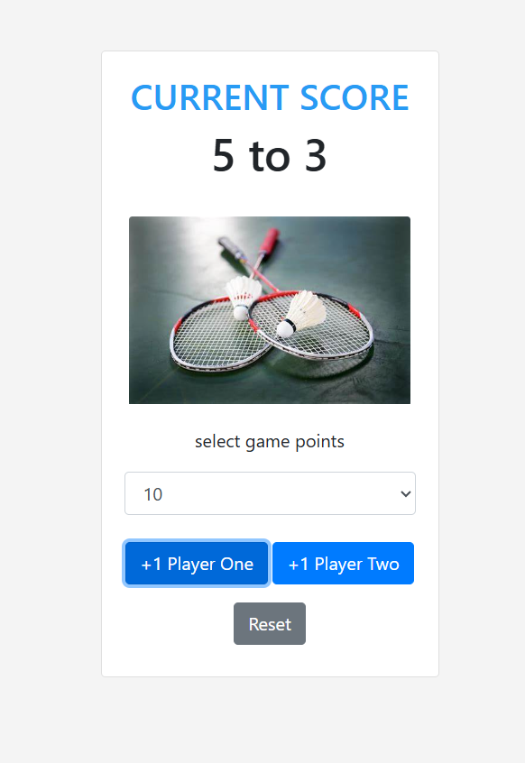
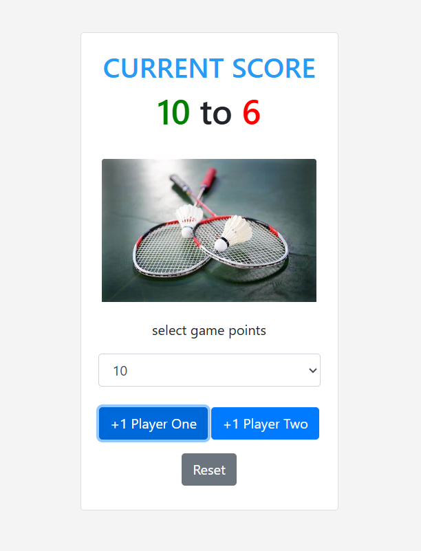

# Score Keeper Web App

A simple score-keeping web application built using HTML, CSS (Bootstrap), and JavaScript. This app allows two players to increment their scores, select a winning score, and reset the game.

## Features

- **Increment Player Scores**: Players can click buttons to increase their respective scores.
- **Winning Score Selection**: A dropdown allows the user to select the maximum score required to win.
- **Winner & Loser Highlighting**: When a player reaches the winning score, the winner's score turns green and the loser's score turns red.
- **Reset Functionality**: The game can be reset at any point to restart the scores.

## Technologies Used

- **HTML**: For the basic structure of the web page.
- **CSS**: For styling, with Bootstrap 4.5 for layout and component styling.
- **JavaScript**: For game logic and interactivity.

## How It Works

1. Two players can increment their scores by clicking the respective player buttons (`+1 Player One` and `+1 Player Two`).
2. The game ends when one player reaches the selected winning score. The winner's score is highlighted in green and the loser's score is highlighted in red.
3. A dropdown menu allows the user to select the score needed to win (from 3 up to 21 points).
4. The `Reset` button resets the game, clearing the scores and allowing players to start over.

## Project Structure
### index.html

This file contains the structure of the web page, including the buttons, score display, and winning score dropdown. The layout is created using Bootstrap for quick styling and responsiveness.

### app.js

This file handles the game logic:
- Keeps track of player scores.
- Detects when a player reaches the winning score.
- Updates the DOM to display the current scores and handle game states.
- Resets the game.

## Usage

1. Clone or download the repository.
2. Open the `index.html` file in any modern web browser.
3. Start playing by clicking the `+1 Player One` or `+1 Player Two` buttons to increment scores.
4. Choose the winning score from the dropdown menu to set the game target.
5. Press the `Reset` button to start a new game.

## Screenshots

Here is how the app looks:

1. **Initial State**

   

2. **Game in Progress**

   

3. **Game Over State**

   

## Dependencies

- [Bootstrap 4.5.2](https://getbootstrap.com/)
- [jQuery 3.5.1](https://jquery.com/)
